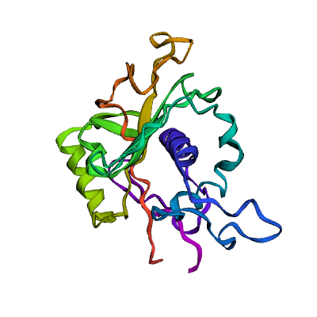
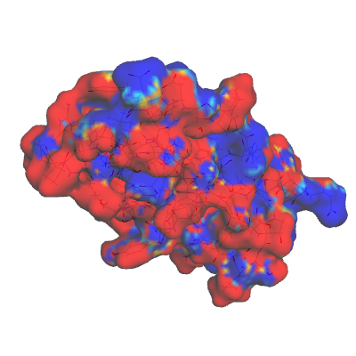
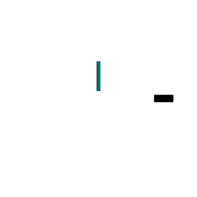

# 3Dmol.js
[](https://cdnjs.com/libraries/3Dmol)
[](https://codecov.io/gh/3dmol/3Dmol.js)
[](https://github.com/3dmol/3Dmol.js/actions)

3Dmol.js is an object-oriented, webGL based JavaScript library for online molecular visualization - No Java required!

Since 3Dmol.js is licensed under the permissive BSD open-source license, you are free to use it in any project, as long the code is properly acknowledged and [cited](http://dx.doi.org/10.1093/bioinformatics/btu829).

With 3Dmol.js, you can add beautifully rendered molecular visualizations to your web applications. Features include:
* support for pdb, sdf, mol2, xyz, and cube formats
* parallelized molecular surface computation
* sphere, stick, line, cross, cartoon, and surface styles
* atom property based selection and styling
* labels
* clickable interactivity with molecular data
* geometric shapes including spheres and arrows

See the [documentation](https://3dmol.org/doc/index.html) to learn how to use 3Dmol.js as a hosted viewer, embeddable viewer, or as a component of a larger application.

## Examples

#### PDB
We support the use of both PDB queries as well as PDB files.



First you simply create the viewer with a div's id.
```javascript
var viewer = $3Dmol.createViewer($("#div"));
```
Then you can download a protein data bank model (here pdb:1MO8) and display it with the styling of your choosing.

```javascript
$3Dmol.download("pdb:1MO8",viewer,{multimodel:true, frames:true},function(){
	viewer.setStyle({}, {cartoon:{color:"spectrum"}});
	viewer.render();
});

```
#### Surfaces
We also support the use of surfaces that are asynchronously loaded and support different color schemes



```javascript
viewer.addSurface($3Dmol.SurfaceType.VDW, {
    opacity:0.85,
    voldata: new $3Dmol.VolumeData(volumedata, "cube"),
    volscheme: new $3Dmol.Gradient.ROYGB(range[1],range[0])
},{});
```

#### Shapes
The use of different shapes and styles is supported.



```javascript
viewer.addCylinder({start:{x:0.0,y:2.0,z:0.0},
    end:{x:0.0,y:10.0,z:0.0},
    radius:0.5,
    fromCap:false,
    toCap:true,
    color:'teal'});
viewer.addCylinder({start:{x:15.0,y:0.0,z:0.0},
    end:{x:20.0,y:0.0,z:0.0},
    radius:1.0,
    color:'black',
    fromCap:false,
    toCap:false});
```

## Documentation

Please check out our documentation at [3dmol.js](https://3dmol.org/doc/index.html). We have tutorials, as well as the stable release of the platform.

## Contact

Please address any questions or concerns to [dkoes@pitt.edu](mailto:dkoes+3dmol@pitt.edu).
You may also [submit an issue](https://github.com/3dmol/3Dmol.js/issues/new/choose) on github.

## Citing

If you use 3Dmol.js, please cite our [Bioinformatics paper](http://bioinformatics.oxfordjournals.org/content/31/8/1322).

## Funding

3DMol.js is funded through R35GM140753 (and previously R01GM108340) from the National Institute of General Medical Sciences. The content is solely the responsibility of the authors and does not necessarily represent the official views of the National Institute of General Medical Sciences or the National Institutes of Health.
