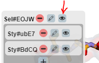
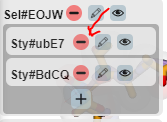

# UI Tests 

UI testing is divided into two part. First **expect** and **action**, `expect` mean to look for the described output, if the desired expectations are not met then the ui testing is failed for the block in which `expect` is called. `action` refers to the interactions that user needs to do on the 3Dmol ui to reach the desired expectations. Inability of performing the described action means the ui testing has failed for the block in which action is called.

## Test 1 : Loading data from data base 

**expect** : The following ui must be present at the top of the viewer on call of `viewer.ui.initiateUI()` where viewer is created by using `3Dmol.createViewer` function call. 

### Test 1.1 : Incorrect input submission 

**action** : click on submit button (green circular button with tick icon)

**expect** : Follwing change must be observed 

## Test 2 : Loading files using model bar  

### Test 2.1 : New Model addition in 3Dmol js

**action** Change select to `pdb `and enter text `6zzm`in the input text area and press `enter` or submit button.

**expect** Follwoing change in the title bar must be observed and UI must load a line figure of the whole model

**action** : repeat the action mentioned above but change input fields as per the following table 

**expect** images in the third column must be expected 

| Drop down list value | Text input value | Desired Output                                               |
| -------------------- | ---------------- | ------------------------------------------------------------ |
| mmtf                 | 4hhb             |  |
| cid                  | 2244             |  |

 

### Test 2.2 : Hide/Show Model Toolbar

**action** : Click on the button with molecule as a symbol 

**expect** : Title bar hidden 

**action** : Click on the button with molecule as a symbol 

**expect** : Title bar shown

## Test 3 : Selection Box

**action** : Load molecule 6zzm using model toolbar as shown in **Test 1**

**expect** : Molecule loaded and line structure is shown in the viewport 

**action** :  Click on button with hand

**expect** : Plus button below it will be shown 

### Test 3.1 : Addition of new selection before completion of previous form

**action** : Click on plus button 

**expect** : New selection card will be added 

**action** : Click on plus button 

**expect** : Warning to complete the form should be shown

### Test 3.2 : Addition of new selection : all atom 

**action** : Click on plus button 

**expect** : New selection card will be added 

**action** : Check Select All atom 

**expect** : All other option becomes invisible 

**action** : Click on submit button 

**expect** : A new selection similar to follwoing image will be created with different id 

### Test 3.3 : Addition of new selection : other selection 

**action** : Click on plus btton 

**expect** : New selection card will be created 

**action** : Check elem option 

**expect** : Input field wll be visible 

#### Test 3.3.1 : Empty Selection 

**action** : Enter `NotAtom` as input 

**action** : click submit button 

**expect** : Error No atom selected 

#### Test 3.3.2 : Carbon Atom only 

**action** : Enter `C` as input and press submit 

**expect** : New selection created with id 

### Test 3.4 : Addition of new selection : Range Input 

**action** : Click on plus button 

**expect** : New selection card will be created 

**action** : Check `resi` and input range separated by comma `431-500,550-600`

**action** : Click on submit 

**expect** : New Card will be created 

### Test 3.5 : Addition of new selection : hetflag

**action** : Click on plus button 

**expect** : New selection card will be created 

**action** : Check `hetflag` and click submit 

**expect** : New Card will be created 

### Test 3.6 : Addition of new selection : Only carbon hetero atom 

**action** : Click on plus button 

**expect** : New selection card will be created 

**action** : Check `hetflag`, Check `elem` and enter `C` in the input field and click submit 

**expect** : New Card will be created 

### Test 3.7 : Addition of new selection : Chain A

**action** : Click on plus button 

**expect** : New selection card will be created 

**action** : Check `chain` and enter `A` in the input field and click submit 

**expect** : New Card will be created 

### Test 3.8 : Addition of new selection : Chain B

**action** : Click on plus button 

**expect** : New selection card will be created 

**action** : Check `chain` and enter `B` in the input field and click submit 

**expect** : New Card will be created 

## Test 4 : Addition of style 

### Test 4.1 : Addition of line style 

**action** : Click on plus atom in the selection card generated from Test 3.2 

**action** : Check `line `and press submit 

**expect** : Viewport has all the atoms drawn as line structure 

### Test 4.2 : Addition of cross style 

**action** : Click on plus atom in the selection card generated from Test 3.5 

**action** : Check `cross `

**action** : Check `colorscheme` and select `ssPyMol `from the dropdown list 

**expect** : Viewport has hetero atom drawn as cross structure 

### Test 4.3 : Addition of stick style 

**action** : Click on plus atom in the selection card generated from Test 3.7 

**action** : Check `stick `

**action** : Check `colorscheme` and select `orangeCarbon`from the dropdown list 

**action** : Check `singleBonds` 

**expect** : Viewport has chain A atom drawn as stick structure 

### Test 4.4 : Addition of sphere style 

**action** : Click on plus atom in the selection card generated from Test 3.6 

**action** : Check `sphere `

**action** : Check `color` and select any color with red shade from the color menu 

**action** : Check `radius` and enter `0.4` and press submit

**expect** : Viewport has hetero carbon atom drawn as red sphere structure 

### Test 4.5 : Addition of Cartoon Style 

#### Test 4.5.1 : Cartoon Spectrum 

**action** : Click on plus atom in the selection card generated from Test 3.7 

**action** : Check `cartoon `

**action** : Check `color` and check `spectrum`

**expect** : Viewport has chain A atom drawn as cartoon with spectrum colors. 

#### Test 4.5.2 : Cartoon Colored 

**action** : Click on plus atom in the selection card generated from Test 3.8 

**action** : Check `cartoon `

**action** : Check `color` and select any color of your choice 

**expect** : Viewport has chain B atom drawn as cartoon with selected color

## Test 5 : Addition of new surface 

**action** : Click on surface button 

**expect** : plus button shown 

### Test 5.1 : Surface with default options 

**action** : Click on plus button 

**expect** : Surface card created 

**action** : Click on plus button 

**expect** : Warning shown to complete the first card 

**action** : Click submit button 

**expect** : VDW type surface added for all the atom and surface card with id created

action : Click on the `-` symbol on the surface to remove this surface 

expect : Surface created will be removed 

### Test 5.2 : Surface with opacity for all atom 

**action** : Click on plus button 

**expect** : Surface card created 

**action** : Select opacity to some other value than 1 

**action** : Click submit button 

**expect** : VDW type surface added for all the atom and surface card with id created

### Test 5.3 : Surface made from self atom 

**action** : click on plus button 

**expect** : Surface card created 

**action** : Select `opacity `to around 0.6

**action** : Check `color` and set color to some shade of light blue 

**action** : Select self in surface atoms 

**action** : Select id created by Test 3.5 in show atom 

**action** : Click `submit` option 

**expect** : VDW surface will be created around hetero carbon atoms

## Test 6 :  Labels 

### Test 6.1 : Add atom label error message 

**action** : Click on spheres created by test 4.4 and add atom labels by clicking submit button 

**expect** : Error message in the context menu 

**action** : Click outside to hide the context menu 

### Test 6.2 : Add atom label 

**action** : Click on any atom which can be clicked on the screen

**expect** : Context menu opened 

**action** : select property `x, y, z` and click submit button 

**expect** : Label added at the atom location with `x, y, z` shown in the atom label 

### Test 6.3 : Remove atom label 

**action** : Click on atom with the label 

**expect** : Context menu opened with `remove atom label` option 

**action** : Click on `Remove Label` option 

**expect** : Context menu hidden and label removed from the atom 

### Test 6.4 : Add Selection Label 

**action** : Right click on any place in the viewport 

**expect** : Context Menu shows up 

**action** : Click `Add Label `

**action** : Input `Label Text`: Hetero Atom 

**action** : Set `Label Style` : Purple 

**action** : Set selection generated by Test 3.6

**action** : Click submit button 

**expect** : A label added at the centroid of the atoms selected by selection of Test 3.6

## Test 7 : Edit Selections and Style 

**action** : click on the button with pencil in the style card 

**expect** : parameters for the style are shown 

**action** : Change the style value of any of the previously created style and click submit 

**expect** : The changes will be reflected in the view port 

**action** : Change the selection value of any of the previously created selection and click submit in the similar way

**expect** : The changes will be reflected in the view port in the styles drawn using that selection (no change on the previously generated surfaces)

## Test 8 : Hide and remove style and selection 

**action** : Click on the eye button show on any of the selection 

**expect** : Objects drawn through that selection will be hidden 

**action** : Click on the eye button shown on the selection 

**expect** : Selection shown again 

**action** : Repeat the same for any style in the selection 

**expect** : Similar behaviour as shown above expect the ui should now only toggle a particular style 

**action** : Click on `-` button in the style card 

**expect** : Style card and drawing will be removed 

**action** : Click `-` button on the selection card

**expect** : Selection card will be removed 

## Test 9 : Edit surfaces 

**action** : Click the pencil icon on the surface card 

**expect** : Parameters of the surface are shown 

**action** : Change the surface parameters to some other acceptable parameters and click submit 

**except** : New surface generated determined by the changed specification 

## Test 10 : Removal of surfaces, styles and selections

**action** : Click on `-` button on the cards on the display 

**expect** : On clicking `-` card the figures generated by that card will be removed 

## Notes

* When the window is resized its overflow is updated but if the size of the window goes below 400 px then overflow padding that is coded in the lib does not work. For mobile devices the UI needs a redesign but works fine on the bigger screen

* The tests for data uri loading are saved in 3dmol-ui.html but are commented out, to use those tests uncomment the divs and compare the images for those divs 